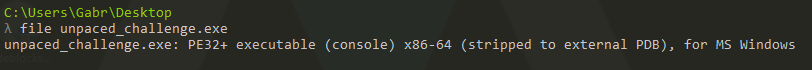
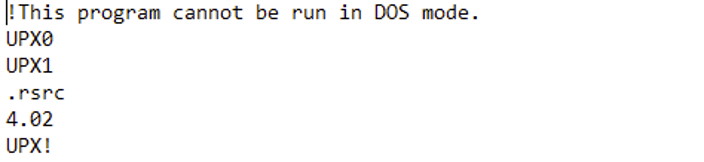
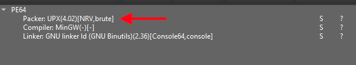
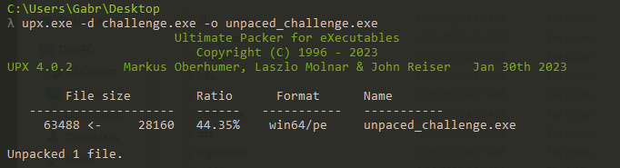
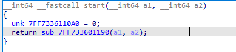
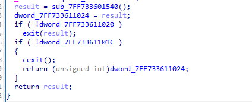
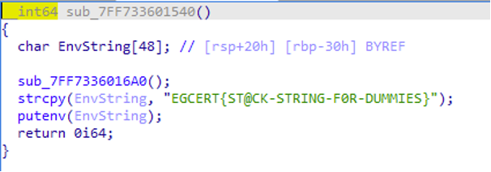

### Challenge Description :
As simple as a b c

First of all lets gather information about the architecture of the EXE file

Then I analyzed the strings of the executable and as you can see below it is packed by UPX  

You can also use “detect it easy” program 

But that wasn’t a big deal as UPX can be unpacked easily , to do so we use the UPX program as shown below :-

But that wasn’t a big deal as UPX can be unpacked easily , to do so we use the UPX program as shown below :-

We can see that it only calls the “sub_7FF733601190” function which we can say it is the main function after analyzing the main function we see that it either return variable called result or it exits 

We can see that it only calls the “sub_7FF733601190” function which we can say it is the main function after analyzing the main function we see that it either return variable called result or it exits 

